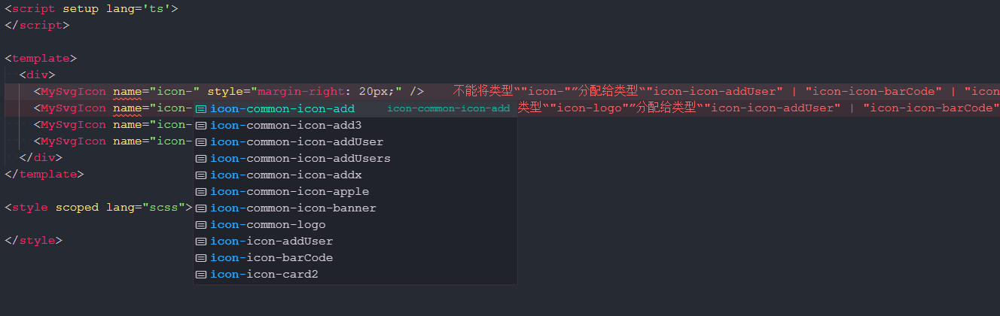

# unplugin-svg-component
**English** | [中文](./README.zh_CN.md)

unplugin-svg-component inspired by [vite-plugin-svg-icons](https://github.com/vbenjs/vite-plugin-svg-icons).

It will generate a Vue component through SVG files,  use the SVG icon through the component.

## Features

* **intelligent** When using components, the name of the SVG file will be prompted with Typescript
* **HMR** HMR for svg file



## Installation 

```shell
yarn add unplugin-svg-component -D
# or
npm i unplugin-svg-component -D
# or
pnpm install unplugin-svg-component -D
```

## Usage

<details>
<summary>Vite config</summary><br>

```ts
// vite.config.ts
import { defineConfig } from 'vite'
import UnpluginSvgComponent from 'unplugin-svg-component/vite'
export default defineConfig({
  plugins: [
    UnpluginSvgComponent({ /* options */ }),
  ],
})
```
<br></details>


<details>
<summary>Vue-cli config</summary><br>

```js
// vue.config.js
const { defineConfig } = require('@vue/cli-service')
const UnpluginSvgComponent = require('unplugin-svg-component/webpack').default

module.exports = defineConfig({
  configureWebpack: {
    plugins: [
      UnpluginSvgComponent({ /* options */ })
    ]
  }
})
```
<br></details>

<details>
<summary>Webpack config</summary><br>

```js
// webpack.config.js
const UnpluginSvgComponent = require('unplugin-svg-component/webpack').default

module.exports = {
  /* ... */
  plugins: [
    UnpluginSvgComponent({ /* options */ }),
  ],
}
```
<br></details>

<details>
<summary>Rollup config</summary><br>

```js
// rollup.config.js
import UnpluginSvgComponent from 'unplugin-svg-component/rollup'

export default {
  plugins: [
    UnpluginSvgComponent({ /* options */ }),
  ],
}
```
<br></details>

<details>
<summary>Esbuild config</summary><br>

```js
// esbuild.config.js
import { build } from 'esbuild'
import UnpluginSvgComponent from 'unplugin-svg-component/esbuild'

build({
  /* ... */
  plugins: [
    UnpluginSvgComponent({
      /* options */
    }),
  ],
})
```
<br></details>


```ts
// main.ts
import SvgIcon from '~virtual/svg-component'
app.component(SvgIcon.name, SvgIcon)
```


## Plugin Configuration

```ts
UnpluginSvgComponent({
  iconDir: path.resolve(__dirname, 'icons'),
  dts: false, // default
  dtsDir: process.cwd(), // default
  svgSpriteDomId: '__svg_sprite__dom__', // default
  componentName: 'SvgIcon', // default
  componentStyle: 'width: 1em; height: 1em; fill:currentColor;', // default
  // Usually, the plugin will set SVG's fill and stroke with 'currentColor',
  // use this option to preserve its original color.
  preserveColor: /logo\.svg$/,
  prefix: '', // default
  symbolIdFormatter: (svgName: string, prefix: string): string => {
    const nameArr = svgName.split('/')
    if (prefix)
      nameArr.unshift(prefix)
    return nameArr.join('-').replace(/\.svg$/, '')
  }, // default, format symbolId
  optimizeOptions: undefined // default, svgo optimize options
})
```

## Typescript support
```json
// tsconfig.json
{
  "include": ["svg-component.d.ts", "svg-component-global.d.ts"]
}
```

## License
MIT License © 2022-PRESENT [Jevon617](https://github.com/Jevon617)
