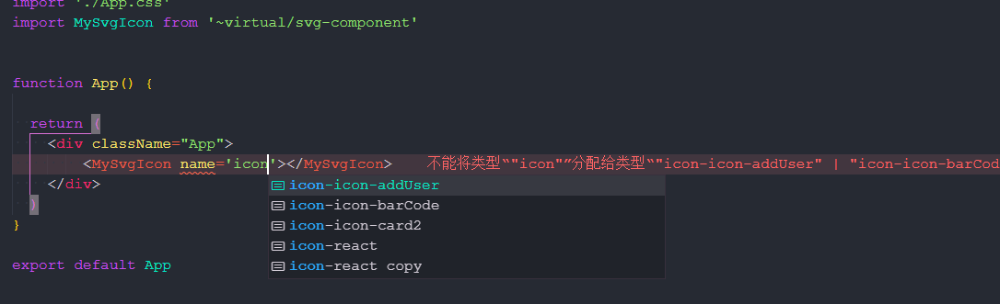

# unplugin-svg-component

**English** | [中文](./README.zh_CN.md)

[![NPM Version][npm-image]][npm-url]
[![Downloads Stats][npm-downloads]][npm-url]

> unplugin-svg-component inspired by [vite-plugin-svg-icons](https://github.com/vbenjs/vite-plugin-svg-icons), it will generate a Vue/React component through SVG files,  use the SVG icon through the component.

## IDE Intelligent

### Vue


### React



## Features

* **intelligent**: When using components, the name of the SVG file will be prompted with Typescript
* **HMR**: HMR for svg file
* **Vue & React**: Support Vue&React and automatically detect project types.
* **Tree-shaking**: Only bundle the icons you really use since **v0.5.0**.
* **SSR**: Support SSR since **v0.6.0**.


## Installation 

```shell
yarn add unplugin-svg-component -D
# or
npm i unplugin-svg-component -D
# or
pnpm install unplugin-svg-component -D
```

## Usage

<details>
<summary>Vite config</summary><br>

```ts
// vite.config.ts
import { defineConfig } from 'vite'
import UnpluginSvgComponent from 'unplugin-svg-component/vite'

export default defineConfig({
  plugins: [
    UnpluginSvgComponent({ /* options */ }),
  ],
})
```
<br></details>


<details>
<summary>Vue-cli config</summary><br>

```js
// vue.config.js
const { defineConfig } = require('@vue/cli-service')
const UnpluginSvgComponent = require('unplugin-svg-component/webpack').default

module.exports = defineConfig({
  configureWebpack: {
    plugins: [
      UnpluginSvgComponent({ /* options */ })
    ]
  }
})
```
<br></details>

<details>
<summary>Webpack config</summary><br>

```js
// webpack.config.js
const UnpluginSvgComponent = require('unplugin-svg-component/webpack').default

module.exports = {
  /* ... */
  plugins: [
    UnpluginSvgComponent({ /* options */ }),
  ],
}
```
<br></details>

<details>
<summary>Rollup config</summary><br>

```js
// rollup.config.js
import UnpluginSvgComponent from 'unplugin-svg-component/rollup'

export default {
  plugins: [
    UnpluginSvgComponent({ /* options */ }),
  ],
}
```
<br></details>

<details>
<summary>Esbuild config</summary><br>

```js
// esbuild.config.js
import { build } from 'esbuild'
import UnpluginSvgComponent from 'unplugin-svg-component/esbuild'

build({
  /* ... */
  plugins: [
    UnpluginSvgComponent({
      /* options */
    }),
  ],
})
```
<br></details>

### Vue
```ts
// main.ts
import SvgIcon from '~virtual/svg-component'

app.component(SvgIcon.name, SvgIcon)
```

### React
```tsx
// App.tsx
import SvgIcon from '~virtual/svg-component'

function App() {
  return (
    <div className="logo">
      <SvgIcon name='icon-react'></SvgIcon>
    </div>
  )
}
```

### Get `svgNames` / type `SvgName`

```ts
// all svg icon name
import { svgNames } from '~virtual/svg-component'

// type SvgName = "icon-icon-addUser" | "icon-icon-barCode"
import type { SvgName } from '~virtual/svg-component'
```

## Plugin Configuration

| Parameter             | Type                       | Default                                        | Description                                         |
| -----------           | ----------------------     | ---------------------                          | ------------                                        |
| iconDir               | `string \| string[]`     | -                                              | the icon folder of the Sprite image                 |
| projectType           | `vue \| react \| auto`     | auto                                           | the project type, detect automatically              |
| dts                   | `boolean`                  | -                                              | whether generate d.ts file                          |
| dtsDir                | `string`                   | -                                              | d.ts location                                       |
| prefix                | `string`                   | -                                              | symbolId prefix                                     |
| componentName         | `string`                   | SvgIcon                                        | the name of component                               |
| componentStyle        | `string`                   | width: 1em; height: 1em; fill:currentColor;    | the style of component                              |
| preserveColor         |`RegExp`                    | -                                              | usually, the plugin will set SVG's fill and stroke with 'currentColor', this option will perform regular matching on each SVG path, the successfully matched SVG will not do the replacement, but retain the original color.  |
| symbolIdFormatter     | `(svgName:string, prefix: string)=>string` | [look this way](./src/core/utils.ts/#L33)               | the symbolId's formatter            |
| optimizeOptions       | `SvgoOptions` | -          | svgo optimize [Options](https://github.com/svg/svgo) |
| svgSpriteDomId        | `string`                   | __svg_sprite__dom__                            | Customize the ID of the svgDom                      |
| vueVersion            | `2 \| 3 \| auto`           | auto                                           | Vue version                                         |
| treeShaking           | `boolean`                  | false                                          | whether enable tree-shaking                         |
| scanGlob            | `string[]`           | [look this way](./src/core/utils.ts/#L41)                        |  the glob pattern used in tree-shaking                                          |
| scanStrategy            | `text \| component \| (code: string[], options: Options)=>string[]`       | component                        |  the strategy used for tree-shaking will not be bundled into the final bundle if it is not successfully matched. The `text` option indicates matching by svg name, so you should ensure the uniqueness of your svg name (you can consider customizing it with the 'symbolIdFormatter' option) to avoid erroneous tree-shaking, while the default value of the `component` option indicates matching by component as a whole, In addition, you can also implement a tree-shaking strategy by passing a function whose return value represents the set of SVG icons used.                                          |

## Typescript support
```json
// tsconfig.json
{
  "include": ["svg-component.d.ts", "svg-component-global.d.ts"]
}
```

## Best Practices

You can refer to [examples](./examples) as required. Note that the configuration in examples is the default configuration.

## Contributing

1. Fork it (<https://github.com/Jevon617/unplugin-svg-component/fork>)
2. Create your feature branch (`git checkout -b feature/fooBar`)
3. Commit your changes (`git commit -am 'Add some fooBar'`)
4. Push to the branch (`git push origin feature/fooBar`)
5. Create a new Pull Request

## License
MIT License © 2022-PRESENT [Jevon617](https://github.com/Jevon617)


<!-- Markdown link & img dfn's -->
[npm-image]: https://img.shields.io/npm/v/unplugin-svg-component.svg?style=flat-square
[npm-url]: https://npmjs.org/package/unplugin-svg-component
[npm-downloads]: https://img.shields.io/npm/dm/unplugin-svg-component.svg?style=flat-square
[travis-image]: https://img.shields.io/travis/dbader/node-datadog-metrics/master.svg?style=flat-square
[travis-url]: https://travis-ci.org/dbader/node-datadog-metrics
[wiki]: https://github.com/yourname/yourproject/wiki
