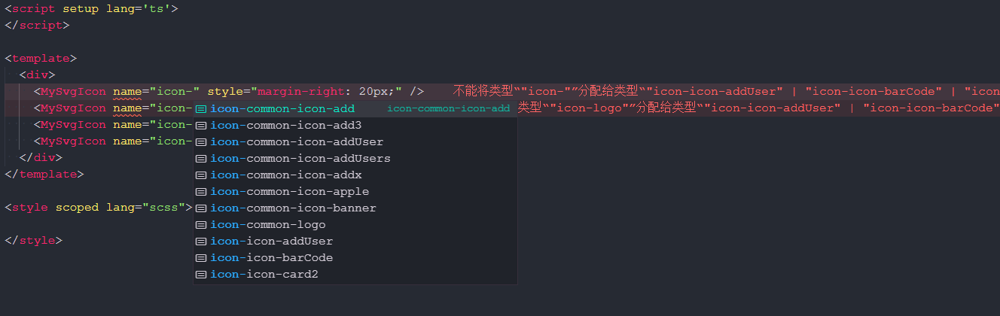
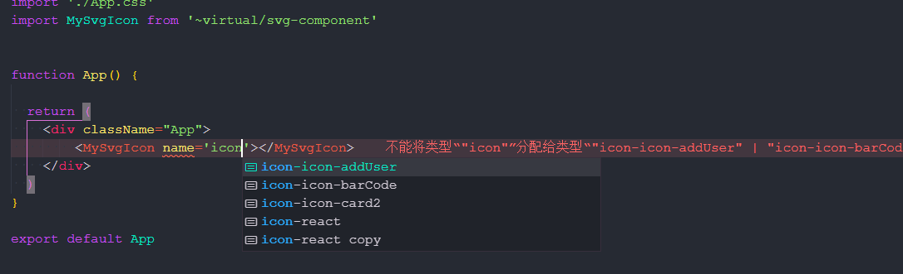

# unplugin-svg-component

[English](./README.md) | **中文**

[![NPM Version][npm-image]][npm-url]
[![Downloads Stats][npm-downloads]][npm-url]

> unplugin-svg-component 启发于[vite-plugin-svg-icons](https://github.com/vbenjs/vite-plugin-svg-icons),它将本地的svg文件生成为一个 vue/react 组件, 通过该组件结合svg文件的名称使用svg图标。

## 智能提示效果

### Vue


### React



## 功能

* **智能提示**: 使用组件时, 配合 Typescript 会提示出 svg 文件名称
* **热更新**: svg文件的增删改操作, 都会实时显示于页面上, 无需刷新浏览器
* **Vue & React 支持**: 自动检测项目类型


## 安装 

```shell
yarn add unplugin-svg-component -D
# or
npm i unplugin-svg-component -D
# or
pnpm install unplugin-svg-component -D
```

## 使用

<details>
<summary>Vite config</summary><br>

```ts
// vite.config.ts
import UnpluginSvgComponent from 'unplugin-svg-component/vite'
export default defineConfig({
  plugins: [
    UnpluginSvgComponent({ /* options */ })
  ],
})
```
<br></details>


<details>
<summary>Vue-cli config</summary><br>

```js
// vue.config.js
const { defineConfig } = require('@vue/cli-service')
const UnpluginSvgComponent = require('unplugin-svg-component/webpack').default

module.exports = defineConfig({
  configureWebpack: {
    plugins: [
      UnpluginSvgComponent({ /* options */ })
    ]
  }
})
```
<br></details>

<details>
<summary>Webpack config</summary><br>

```js
// webpack.config.js
const UnpluginSvgComponent = require('unplugin-svg-component/webpack').default

module.exports = {
  /* ... */
  plugins: [
    UnpluginSvgComponent({ /* options */ }),
  ],
}
```
<br></details>

<details>
<summary>Rollup config</summary><br>

```js
// rollup.config.js
import UnpluginSvgComponent from 'unplugin-svg-component/rollup'

export default {
  plugins: [
    UnpluginSvgComponent({ /* options */ }),
  ],
}
```
<br></details>

<details>
<summary>Esbuild config</summary><br>

```js
// esbuild.config.js
import { build } from 'esbuild'
import UnpluginSvgComponent from 'unplugin-svg-component/esbuild'

build({
  /* ... */
  plugins: [
    UnpluginSvgComponent({
      /* options */
    }),
  ],
})
```
<br></details>

### Vue
```ts
// main.ts
import SvgIcon from '~virtual/svg-component'
app.component(SvgIcon.name, SvgIcon)
```

### React
```tsx
// App.tsx
import SvgIcon from '~virtual/svg-component'

function App() {
  return (
    <div className="logo">
      <SvgIcon name='icon-react'></SvgIcon>
    </div>
  )
}
```

## 插件配置

| 属性                   | 类型                        | 默认值                                          | 描述                                                |
| -----------           | ----------------------     | ---------------------                          | ------------                                        |
| iconDir               | `string`                   | -                                              | 图标文件夹位置                                         |
| projectType           | `vue \| react \| auto`     | auto                                           | 项目类型, 默认会自动检测                                |
| dts                   | `boolean`                  | -                                              | 是否生成d.ts文件                                       |
| dtsDir                | `string`                   | -                                              | d.ts文件位置                                           |
| prefix                | `string`                   | -                                              | symbolId的前缀                                         |
| componentName         | `string`                   | SvgIcon                                        | 生成的组件名称                                          |
| componentStyle        | `string`                   | width: 1em; height: 1em; fill:currentColor;    | 组件的行内样式                                          |
| preserveColor         |`RegExp`                    | -                                              | 通常, 插件会把svg标签内的fill, stroke属性替换成currentColor, 可以通过此属性保留它们原来的颜色  |
| symbolIdFormatter     | `(svgName:string, prefix: string)=>string` | [code](./src/core/utils.ts/#L33)               | 可以通过这个参数来设置symbolId的格式       |
| optimizeOptions       | `SvgoOptions` | -          |  [svgo 的优化参数](https://github.com/svg/svgo) |
| svgSpriteDomId        | `string`                   | __svg_sprite__dom__                            | 自定义生成的svg元素的id                                  |
| vueVersion            | `2 \| 3 \| auto`           | auto                                           | Vue 版本, 默认会自动检测                                  |


## Typescript 支持
```json
// tsconfig.json
{
  "include": ["svg-component.d.ts", "svg-component-global.d.ts"]
}
```

## Contributing

1. Fork (<https://github.com/Jevon617/unplugin-svg-component/fork>)
2. 新建一个分支 (`git checkout -b feature/fooBar`)
3. 提交你的代码 (`git commit -am 'Add some fooBar'`)
4. 提交到你的远程分支 (`git push origin feature/fooBar`)
5. 提交PR

## License
MIT License © 2022-PRESENT [Jevon617](https://github.com/Jevon617)


<!-- Markdown link & img dfn's -->
[npm-image]: https://img.shields.io/npm/v/unplugin-svg-component.svg?style=flat-square
[npm-url]: https://npmjs.org/package/unplugin-svg-component
[npm-downloads]: https://img.shields.io/npm/dm/unplugin-svg-component.svg?style=flat-square
[travis-image]: https://img.shields.io/travis/dbader/node-datadog-metrics/master.svg?style=flat-square
[travis-url]: https://travis-ci.org/dbader/node-datadog-metrics
[wiki]: https://github.com/yourname/yourproject/wiki
